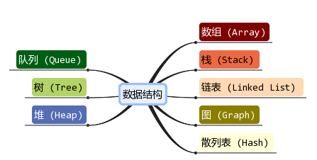

## 数据结构

### 链表
- [PHP实现链表](https://www.cnblogs.com/followyou/p/11162030.html)
- [关于PHP如何实现链表的定义与反转功能](https://www.php.cn/php-weizijiaocheng-404043.html)
- [单链表的翻转递归和非递归方式-php实现](https://blog.csdn.net/zlb_lover/article/details/80415875)

### 栈

### 堆

### 队列

### 树
- [树详解](https://xiaozhuanlan.com/topic/5036471892)
- [数据结构与算法之PHP实现二叉树的遍历](https://www.cnblogs.com/sunshineliulu/p/7775214.html)

### 数组

### 图

### 散列表

