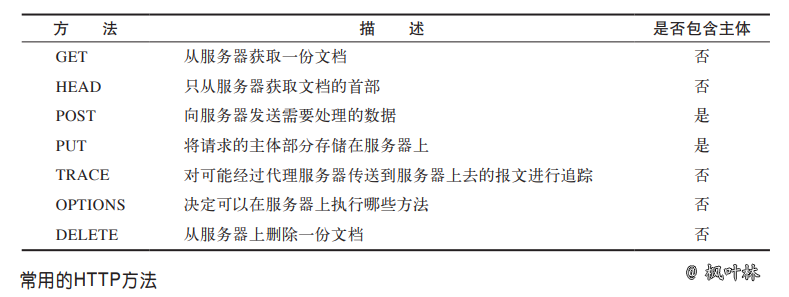
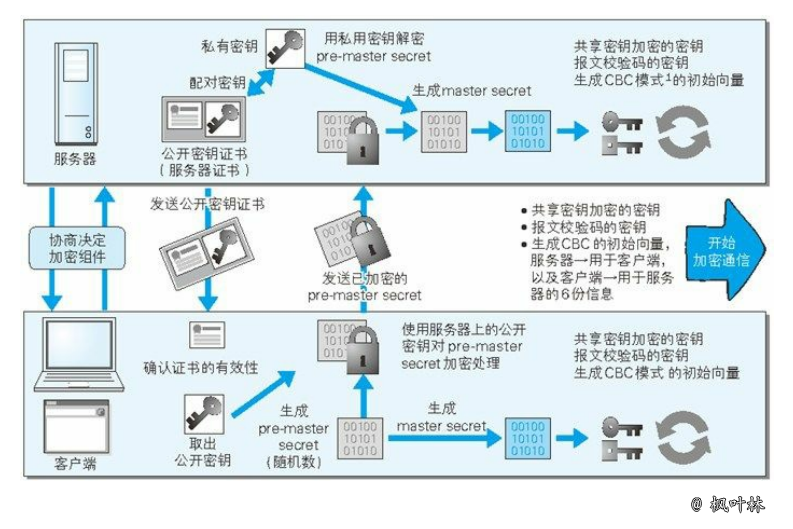

# 网络

## 目录

- [计算机网络体系结构](#计算机网络体系结构)
   - [各层作用](#各层作用)
- [网络模型](#网络模型)
   - [网络io模型](#网络io模型)
   - [网络IO之阻塞、非阻塞、同步、异步总结](#网络IO之阻塞、非阻塞、同步、异步总结)
   - [IO多路复用的三种机制Select，Poll，Epoll](#IO多路复用的三种机制Select，Poll，Epoll)
- [网络协议](#网络协议)
   - [一篇文章带你熟悉 tcp/IP 协议](https://www.jianshu.com/p/9f3e879a4c9c)
   - [tcp(传输控制协议)](#tcp/udp)
     - [tcp的主要特点](#tcp的主要特点)
     - [简述tcp协议三次握手](#简述tcp协议三次握手)
     - [建立tcp连接为什么最后还要发送确认](#建立tcp连接为什么最后还要发送确认)
     - [简述tcp连接的释放](#简述tcp连接的释放)
     - [tcp粘包问题](#tcp粘包问题)
   - [udp(用户数据报协议)](#tcp/udp)
     - [udp的主要特点](#udp的主要特点)
   - [tcp与udp区别](#tcp与udp区别)
   - [一篇文章带你详解 HTTP 协议](https://www.jianshu.com/p/6e9e4156ece3)
   
- [https原理](#https原理)
- socket
- HTTP与WebSocket的区别
- [计算机网络协议高频面试题](https://mp.weixin.qq.com/s?__biz=MzAxMjEwMzQ5MA==&mid=2448885757&idx=1&sn=0b234017a3312359c2da2cfcedb56f19&chksm=8fb55dd0b8c2d4c6e75e34f9a3701e0fd0aa99de447d6568281bffda42c9a1faf597b5a066e7&scene=21#wechat_redirect)
- [从输入URL到页面展示到底发生了什么](#从输入URL到页面展示到底发生了什么)

### 计算机网络体系结构

#### 各层作用
     
- 应用层：应用层协议定义的是应用进程间通信和交互的规则
- 运输层：运输层的任务就是负责向`两台主机中进程之间的通信`提供`通用的数据传输`服务
- 网络层：把运输层产生的报文段或用户数据报封装成`分组`或`包`进行传送
- 数据链路层：将网络层交下来的 IP 数据报组装成帧，并在两个相邻结点间的链路上传送
- 物理层：利用物理媒体以`比特`形式传送数据

### 网络模型

#### 网络io模型

[IO模型浅析-阻塞、非阻塞、IO复用、信号驱动、异步IO、同步IO](https://segmentfault.com/a/1190000016359495)

[事件模型及io多路复用](https://www.cnblogs.com/yuanchenqi/articles/5722574.html)

#### 网络IO之阻塞、非阻塞、同步、异步总结
[一篇文章读懂阻塞，非阻塞，同步，异步](https://www.jianshu.com/p/b8203d46895c)

#### IO多路复用的三种机制Select，Poll，Epoll

[IO多路复用的三种机制Select，Poll，Epoll](https://www.jianshu.com/p/397449cadc9a)

[select，poll，epoll区别总结](https://www.cnblogs.com/Anker/p/3265058.html)

### 网络协议

#### tcp与udp区别

**面向报文**
~~~~
面向报文的传输方式是应用层交给UDP多长的报文，UDP发送多长的报文，即一次发送一个报文。因此，应用程序必须选择合适大小的报文。
~~~~

**面向字节流**
~~~~
虽然应用程序和tcp的交互是一次一个数据块(大小不等)，但tcp把应用程序看成是一连串的无结构的字节流。tcp有一个缓冲，当应该程序传送的数据块太长，tcp就可以把它划分短一些再传送。
~~~~
#### tcp/udp
[一文搞懂什么是tcp/IP协议](https://blog.csdn.net/petterp/article/details/102779131)

[网络协议](https://www.cnblogs.com/Soy-technology/p/11102239.html)

#### udp的主要特点

- UDP 是`无连接的`，即发送数据之前不需要建立连接(发送数据结束时也没有连接可释放)，减少了开销和发送数据之前的时延
- UDP 使用`尽最大努力交付`，即不保证可靠交付，主机不需要维持复杂的连接状态表
- UDP 是`面向报文`的，发送方的 UDP 对应用程序交下来的报文，在添加首部后就向下交付 IP 层。UDP 对应用层交下来的报文，既不合并，也不拆分，而是`保留这些报文的边界`
- UDP `没有拥塞控制`，网络出现的拥塞不会使源主机的发送速率降低。这对某些实时应用是很重要的
- UDP 支持一对一、一对多、多对一和多对多的交互通信
- UDP 的`首部开销小`，只有8个字节，比 tcp 的20个字节的首部要短

拓展阅读 [《用户数据报协议 UDP》](https://blog.maplemark.cn/2019/04/用户数据报协议udp.html)

#### tcp的主要特点

- tcp 是`面向连接的运输层协议`。应用程序在使用 tcp 协议之前，必须先建立 tcp 连接。在传送数据完毕后，必须释放已经建立的 tcp 连接
- 每一条 tcp 连接只能有两个`端点`，每一条 tcp 连接只能是`点对点`的(一对一)
- tcp 提供`可靠交付`的服务。通过 tcp 连接传送的数据，无差错、不丢失、不重复，并且按序到达
- tcp 提供`全双工通信`。tcp 允许通信双方的应用进程在任何时候都能发送数据。tcp 连接的两端都设有发送缓存和接受缓存，用来临时存放双向通信的数据
- `面向字节流`。tcp 中的“流”指的是`流入到进程或从进程流出的字节序列`

拓展阅读 [《传输控制协议 tcp》](https://blog.maplemark.cn/2019/04/tcp协议详解.html)

#### 简述tcp协议三次握手

#### 建立tcp连接为什么最后还要发送确认

这主要是为了防止已失效的连接请求报文段突然又传到了tcp服务器，避免产生错误

#### 简述tcp连接的释放

- 客户端应用进程发出连接释放报文段，并停止再发送数据，进入 FIN-WAIT-1(终止等待1)状态，等待服务器确认
- 服务器收到连接释放报文段后即发出确认，进入 CLOSE-WAIT(关闭等待)状态，服务器若发送数据，客户端扔要接收
- 客户端收到来自服务器的确认后，进入 FIN-WAIT-2(终止等待2)状态，等待服务器发出连接释放报文段
- 服务器没有要发送的数据，发出连接释放报文段，进入 LAST-ACK(最后确认)状态，等待客户端确认
- 客户端收到连接释放报文段后，发出确认，进入 TIME-WAIT(时间等待)状态，经过时间等待计时器设置的时间 2MSL 后，进入 CLOSED(关闭) 状态
- 服务器收到客户端报文段后，进入 CLOSED 状态

#### TIME-WAIT是什么，为什么必须等待 2MLS

TIME-WAIT 是一种 tcp 状态。等待 2MLS 可以保证客户端最后一个报文段能够到达服务器，如果未到达，服务器则会超时重传连接释放报文段，使得客户端、服务器都可以正常进入到 CLOSE(关闭) 状态

#### tcp粘包问题

##### 粘包问题

在 tcp 这种字节流协议上做`应用层分包`是网络编程的基本需求。分包指的是在发生一个消息(message)或一帧(frame)数据时，通过一定的处理，让接收方能从字节流中识别并截取(还原)出一个个消息。因此，“粘包问题”是个伪命题

##### 长连接分包

- 消息长度固定
- 使用特殊的字符或字符串作为消息的边界，例如 HTTP 协议的 headers 以“\r\n”为字段的分隔符
- 在每条消息的头部加一个长度字段，这恐怕是最常见的做法
- 利用消息本身的格式来分包，例如 XML 格式的消息中 `<root>`...`</root>` 的配对，或者 JSON 格式中的 { ... } 的配对。解析这种消息格式通常会用到状态机(state machine)

拓展阅读 [《tcp粘包拆包》](https://blog.maplemark.cn/2019/04/tcp粘包拆包.html)

### 一文搞懂什么是tcp/IP协议
tcp/ip协议[《tcp/ip协议》](https://blog.csdn.net/petterp/article/details/102779131)

### 建立socket需要哪些步骤

- 创建 socket
- 绑定 socket 到指定地址和端口
- 开始监听连接
- 读取客户端输入
- 关闭 socket

### DNS主要作用是什么

计算机既可以被赋予 IP 地址，也可以被赋予主机名和域名。用户通常使用主机名或域名来访问对方的计算机，而不是直接通过 IP 地址访问

但要让计算机去理解名称，相对而言就变得困难，因为计算机更擅长处理一长串数字

为了解决上述问题，DNS 服务应运而生。DNS 协议提供通过域名查找 IP 地址，或逆向从 IP 地址反查域名的服务

### Http协议报文格式

[Http协议报文格式](https://www.cnblogs.com/jpfss/p/10984966.html)

### HTTP状态码

> HTTP 状态码用来告诉客户端，发生了什么事情，状态码位于响应的起始行中

#### 状态码分类

|状态码|整体范围|已定义范围|分类|
|-|-|-|-|
|1XX|100~199|100~101|信息提示|
|2XX|200~299|200~206|成功|
|3XX|300~399|300~305|重定向|
|4XX|400~499|400~415|客户端错误|
|5XX|500~599|500~505|服务器错误|

#### 常见状态码

|状态码|原因短语|含义|考察概率|
|---|---|---|---|
|200|OK|请求没有问题|***|
|206|Partial Content|部分或 Range(范围) 请求|*|
|301|Moved Permanently|在请求的链接被移除时使用|**|
|302|Found|在请求临时的链接使用|**|
|304|Not Modified|资源未被修改可使用旧资源|**|
|307|Temporary Redirect|在请求临时的链接使用|**|
|400|Bad Request|告知客户端发送了错误请求|***|
|403|Forbidden|请求被服务器拒绝|***|
|404|Not Found|无法找到所请求的 URL|***|
|413|Request entiry too large|请求实体过大|*|
|500|Internal Server Error|服务器遇到错误|***|
|502|Bad Gateway|代理或网关错误(无法连接到其父网关)|***|
|503|Service Unavailable|无法为请求提供服务|***|
|504|Gateway Timeout|代理或网关超时(等待另一服务器响应超时)|***|

拓展阅读 [《HTTP状态码》](https://blog.maplemark.cn/2019/04/http状态码.html)

拓展阅读 [《5xx系列错误》](../03.PHP/QA.md#502504-错误产生原因及解决方式)

### 常见的HTTP方法

[HTTP请求方式中8种请求方法](https://www.cnblogs.com/weibanggang/p/9454581.html)

### GET与POST请求方式区别

|GET|POST|
|---|---|
|后退按钮/刷新无害|数据会被重新提交|
|数据长度限制/URL长度2048字符|长度无限制|
|数据可见/安全性差|不可见/更安全|
|可以被缓存|不可以被缓存|
|书签可收藏|书签不可收藏|

### HTTP优缺点

基于应用级的接口，使用方便

传输速度慢，数据包大；如实现实时交互，服务器性能压力大；数据传输安全性差

###  HTTPS通信原理

拓展阅读 [《HTTPS细节介绍》](https://www.cnblogs.com/wqhwe/p/5407468.html)

### http和https的区别

HTTPS和HTTP的区别主要如下：

1、https协议需要到ca申请证书，一般免费证书较少，因而需要一定费用。

2、http是超文本传输协议，信息是明文传输，https则是具有安全性的ssl加密传输协议。

3、http和https使用的是完全不同的连接方式，用的端口也不一样，前者是80，后者是443。

4、http的连接很简单，是无状态的；HTTPS协议是由SSL+HTTP协议构建的可进行加密传输、身份认证的网络协议，比http协议安全。

### 从输入URL到页面展示到底发生了什么
[从输入URL到页面展示到底发生了什么](https://juejin.im/entry/5b44155f6fb9a04f932fdf80)

### HTTP 2.0

多路复用、客户端拉拽/服务器推送、流量控制、WebSocket

### WebSocket

WebSocket 是一种通信协议，定义了一个全双工通信信道，仅通过 Web 上的一个 Socket 即可进行通信

#### 主要特点

- 推送功能：支持由服务器向客户端推送数据的推送功能
- 减少通信量：只要建立起 WebSocket 连接，就希望一直保持连接状态

### IPv6 与 IPv4 有什么变化

更大的地址空间、扩展的地址层次结构、灵活的首部格式、改进的选项、允许协议继续扩充、支持资源的预分配

### 什么是心跳机制

心跳机制是定时发送一个自定义的结构体(心跳包)，让对方知道自己还活着，以确保连接的有效性的机制

### 什么是长连接

长连接，指在一个连接上可以连续发送多个数据包，在连接保持期间，如果没有数据包发送，需要双方发链路检测包

### 参考资料

- [计算机网络面试常考总结](https://www.cnblogs.com/anzhengyu/p/11238563.html)
- [网络协议-专题总结以及网络协议高频面试题汇总(8篇)](https://cloud.tencent.com/developer/article/1346228)
